# GARCH Models for Global Equity Indices
### Comparing volatility persistence across the US, euro area, Japan and the UK

**Data:** daily index prices from Yahoo Finance, 2000-01-04 to 2026-07-29
**Models:** GARCH(1,1), GJR-GARCH(1,1) and EGARCH(1,1) with normal, Student-t and skew-t innovations
**Reproduce:** `python -m src.run_analysis`

---

## 1. Objective

Volatility is not constant, and it is not random either. Calm markets stay calm and
turbulent markets stay turbulent, so today's volatility carries information about
tomorrow's. GARCH models formalise that. This project estimates them for four major
equity indices and asks how much they differ across regions.

The specific questions:

1. Which index is the most volatile?
2. Which index has the most **persistent** volatility?
3. Do crisis periods show clear volatility spikes?
4. Does a Student-t GARCH fit better than normal errors?
5. Are the standardised residuals still autocorrelated?
6. How different are volatility dynamics across regions?

---

## 2. Data

| Index | Ticker | Region | Sample | Return obs |
|---|---|---|---|---|
| S&P 500 | `^GSPC` | United States | 2000-01-03 → 2026-07-28 | 6,679 |
| EURO STOXX 50 | `^STOXX50E` | Euro area | 2007-03-30 → 2026-07-27 | 4,840 |
| Nikkei 225 | `^N225` | Japan | 2000-01-04 → 2026-07-29 | 6,505 |
| FTSE 100 | `^FTSE` | United Kingdom | 2000-01-04 → 2026-07-27 | 6,708 |

Returns are log returns scaled by 100. Two data decisions worth stating:

**EURO STOXX 50 has a shorter history.** Yahoo only serves it from March 2007, so it
misses the dot-com aftermath the other three include. Since this is a *comparison* of
persistence, section 7 refits everything on the common window as a robustness check.

**Each index keeps its own trading calendar.** These markets have different holidays.
Forward-filling across a Tokyo holiday would invent a zero return and dampen the very
clustering being measured, so returns are computed per index on that index's observed
days.

---

## 3. Stylised facts

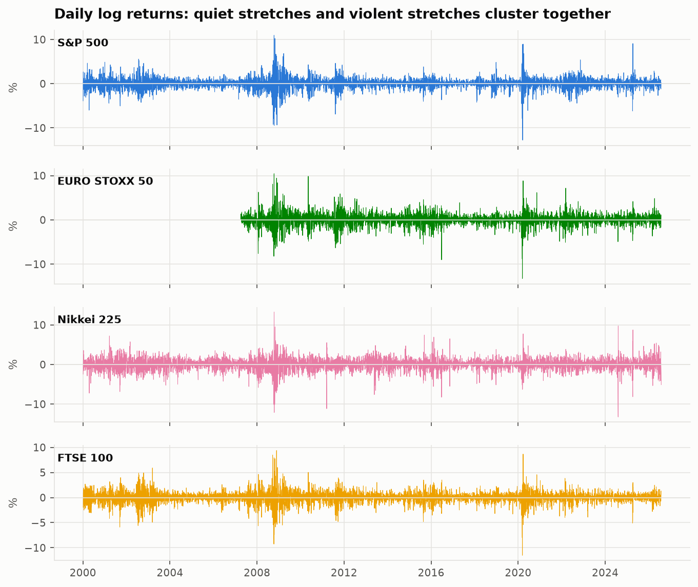

### 3.1 Summary statistics

| Index | Ann. return (%) | Ann. vol (%) | Skew | Excess kurtosis | Worst day (%) | JB p |
|---|---|---|---|---|---|---|
| S&P 500 | 6.15 | 19.29 | −0.35 | 10.65 | −12.77 | 0.000 |
| EURO STOXX 50 | 2.12 | 21.84 | −0.30 | 7.67 | −13.24 | 0.000 |
| Nikkei 225 | 4.56 | 23.47 | −0.38 | 6.88 | −13.23 | 0.000 |
| FTSE 100 | 1.81 | 17.91 | −0.37 | 8.36 | −11.51 | 0.000 |

**Q1 — which index is most volatile?** The **Nikkei 225**, at 23.5% annualised, followed
by EURO STOXX 50 (21.8%), the S&P 500 (19.3%) and the FTSE 100 (17.9%).

Every index is negatively skewed with large positive excess kurtosis. A normal
distribution has excess kurtosis 0; these run from 6.9 to 10.6, and Jarque-Bera rejects
normality overwhelmingly. Losses are both more frequent and more extreme than a normal
model would allow — the first argument for Student-t innovations.

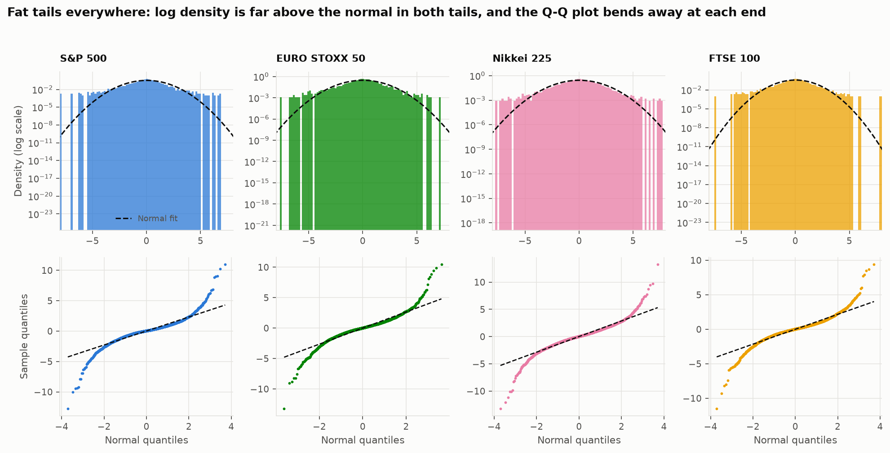

### 3.2 Volatility clustering

| Index | LB(10) returns | p | LB(10) squared | p |
|---|---|---|---|---|
| S&P 500 | 97.1 | 0.000 | 6,096.4 | 0.000 |
| EURO STOXX 50 | 33.5 | 0.000 | 1,877.1 | 0.000 |
| Nikkei 225 | 17.6 | 0.061 | 3,221.0 | 0.000 |
| FTSE 100 | 68.0 | 0.000 | 4,128.8 | 0.000 |

The squared-return statistics are one to two orders of magnitude larger than the
return statistics. **Volatility is strongly predictable even where direction is barely
predictable at all** — precisely the gap GARCH exists to fill.

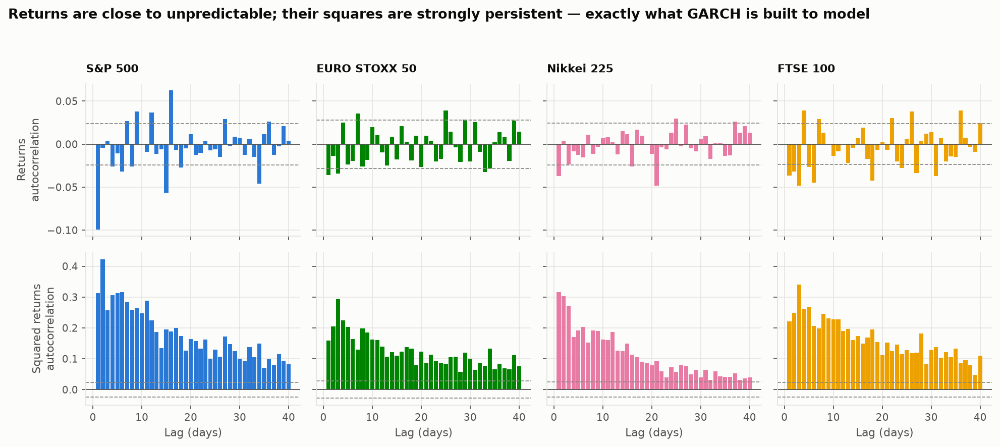

Augmented Dickey-Fuller rejects a unit root in every return series (p < 0.001), so the
stationarity assumption holds.

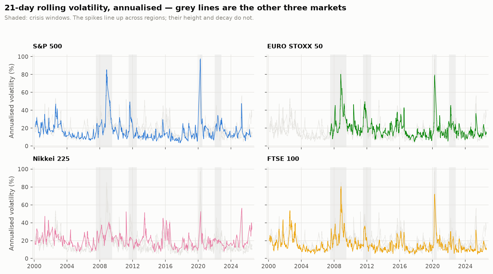

---

## 4. GARCH(1,1) estimates

Constant mean, conditional variance σ²ₜ = ω + α ε²ₜ₋₁ + β σ²ₜ₋₁, normal innovations.

| Index | ω | α | β | **α + β** | Half-life (days) | Long-run ann. vol (%) |
|---|---|---|---|---|---|---|
| S&P 500 | 0.0253 | 0.1204 | 0.8603 | **0.9807** | 35.5 | 18.15 |
| FTSE 100 | 0.0261 | 0.1257 | 0.8525 | **0.9782** | 31.5 | 17.36 |
| EURO STOXX 50 | 0.0473 | 0.1259 | 0.8504 | **0.9763** | 28.9 | 22.44 |
| Nikkei 225 | 0.0572 | 0.1175 | 0.8584 | **0.9760** | 28.5 | 24.48 |

All estimates satisfy α, β > 0 and α + β < 1, so every fitted model is stationary with a
finite long-run variance. All parameters are significant at any conventional level.

Reading a row: **α ≈ 0.12** is how sharply volatility reacts to yesterday's surprise;
**β ≈ 0.86** is how much it remembers yesterday's level; **α + β ≈ 0.98** is persistence.

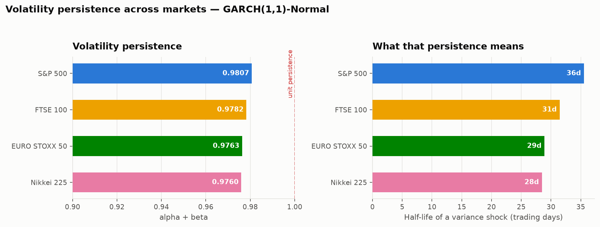

**Q2 — which index has the most persistent volatility?** The **S&P 500**, at
α + β = 0.9807. Its half-life of 35.5 trading days means a US variance shock takes about
seven trading days longer to decay halfway than a Japanese one (28.5 days).

The ordering is worth pausing on, because **persistence and level rank differently**:

| Rank | By volatility level | By persistence |
|---|---|---|
| 1 | Nikkei 225 (23.5%) | S&P 500 (0.9807) |
| 2 | EURO STOXX 50 (21.8%) | FTSE 100 (0.9782) |
| 3 | S&P 500 (19.3%) | EURO STOXX 50 (0.9763) |
| 4 | FTSE 100 (17.9%) | Nikkei 225 (0.9760) |

The ranking is almost exactly inverted. The Nikkei is the most volatile market but the
quickest to settle; the S&P is among the calmest in normal times yet holds onto a shock
longest. These are different risks: the Nikkei's is the size of the move, the S&P's is
its duration. A risk model calibrated on unconditional volatility alone would miss the
second entirely.

The spread is nonetheless narrow — 0.976 to 0.981. **Answering Q6: volatility dynamics
are more alike across regions than they are different.** The interesting variation is in
the level and in the crisis response, not in the decay rate.

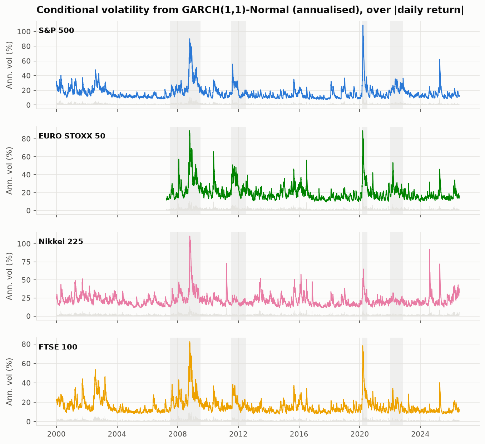

---

## 5. Crisis periods

Mean annualised conditional volatility inside each crisis window:

| Index | Calm | GFC 2008 | Euro crisis 2011 | COVID 2020 | Rates shock 2022 | Peak/calm |
|---|---|---|---|---|---|---|
| S&P 500 | 14.80 | 29.13 | 20.62 | **42.51** | 22.90 | 2.87× |
| EURO STOXX 50 | 17.51 | 28.75 | **28.34** | 40.60 | 23.39 | 2.32× |
| Nikkei 225 | 20.95 | 31.99 | 19.59 | **32.67** | 21.59 | 1.56× |
| FTSE 100 | 14.36 | 27.07 | 20.00 | **36.33** | 16.61 | 2.53× |

**Q3 — do crisis periods show clear spikes?** Unambiguously. Every market at least
1.5× its calm-period volatility at the peak, and the S&P nearly tripled.

Each crisis also has a **regional signature**. The euro sovereign debt crisis lifted
EURO STOXX volatility to 28.3 — its second-worst episode — while the Nikkei sat at 19.6,
*below* its own calm-period average of 20.9. COVID, by contrast, hit everything at once.
The Nikkei's low peak/calm ratio of 1.56 is not resilience: it starts from the highest
calm-period baseline of the four.

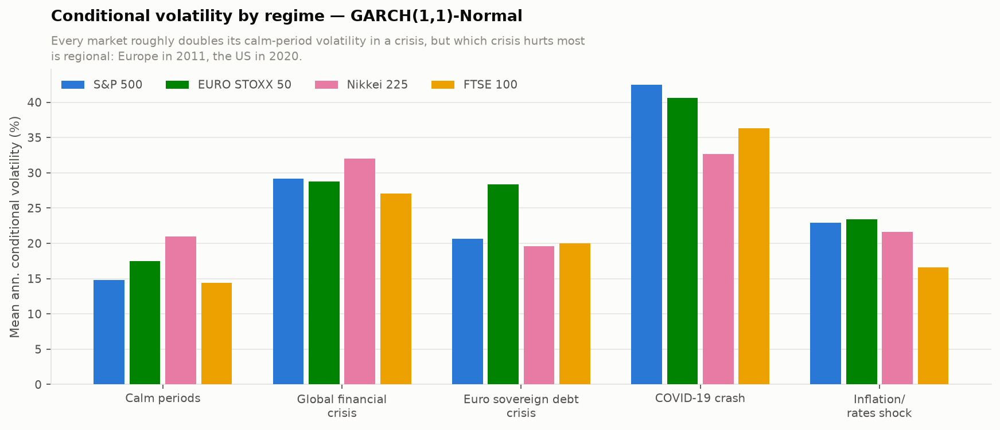

---

## 6. Model selection

Five specifications per index, ranked by BIC (Δ vs each index's best):

| Model | S&P 500 | EURO STOXX 50 | Nikkei 225 | FTSE 100 |
|---|---|---|---|---|
| GJR-GARCH(1,1)-t | **0** | **0** | **0** | **0** |
| GARCH(1,1)-skew-t | 182.8 | 177.2 | 87.6 | 153.5 |
| GARCH(1,1)-t | 223.1 | 188.0 | 99.6 | 186.4 |
| EGARCH(1,1)-t | 247.6 | 181.6 | 90.9 | 196.8 |
| GARCH(1,1)-Normal | 527.8 | 450.1 | 299.1 | 404.3 |

**Q4 — does Student-t beat normal?** Decisively, in every market. Moving from normal to
Student-t improves BIC by 100–300 points for the cost of one parameter; the estimated
degrees of freedom are 5.7–7.5, far from the ν → ∞ that would justify normality.

But the larger gain comes from **asymmetry**. GJR-GARCH-t wins on both AIC and BIC in all
four markets, and the leverage parameter γ is doing most of the work:

| Index | ω | α | γ | β | ν |
|---|---|---|---|---|---|
| S&P 500 | 0.0185 | **0.0000** | 0.2043 | 0.8814 | 6.89 |
| EURO STOXX 50 | 0.0383 | **0.0000** | 0.2225 | 0.8687 | 6.36 |
| Nikkei 225 | 0.0602 | 0.0300 | 0.1448 | 0.8675 | 8.26 |
| FTSE 100 | 0.0233 | **0.0000** | 0.1935 | 0.8787 | 8.49 |

In three of the four markets the symmetric ARCH term **collapses to exactly zero**. The
model is saying that a positive shock, of any magnitude, leaves tomorrow's volatility
essentially unchanged — only negative shocks raise it. The Nikkei retains a small
symmetric term (α = 0.030) and has the weakest leverage effect, the one genuine
cross-regional difference in dynamics this project finds.

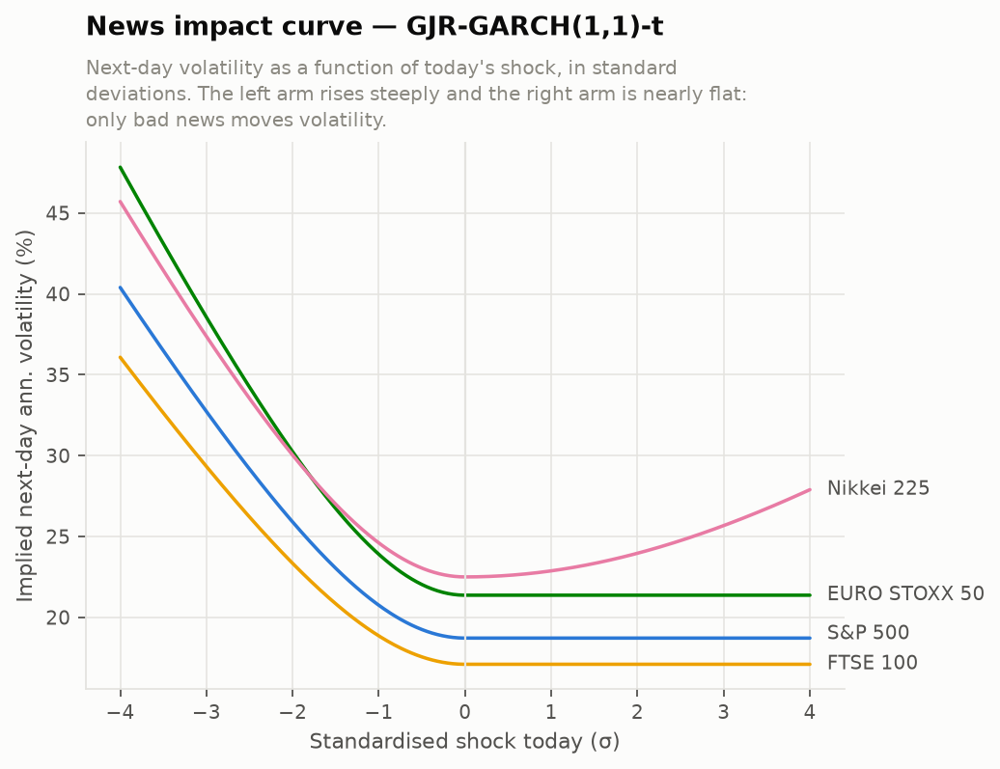

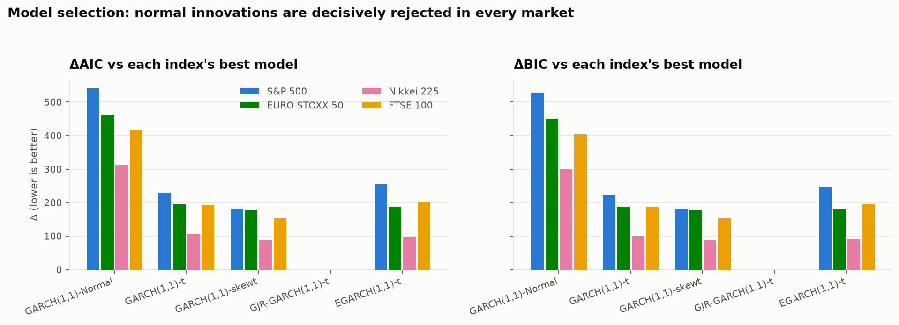

---

## 7. Robustness: is the ranking a sample artefact?

EURO STOXX 50 starts in 2007. Refitting all four indices on the common window
(2007-04-02 onward):

| Index | α+β (full) | Half-life | α+β (common) | Half-life | Δ |
|---|---|---|---|---|---|
| S&P 500 | 0.9807 | 35.5 | 0.9787 | 32.2 | −0.0020 |
| FTSE 100 | 0.9782 | 31.5 | 0.9727 | 25.1 | −0.0055 |
| EURO STOXX 50 | 0.9763 | 28.9 | 0.9763 | 28.9 | 0.0000 |
| Nikkei 225 | 0.9760 | 28.5 | 0.9672 | 20.8 | −0.0088 |

Persistence falls slightly for everyone on the shorter window, but **the S&P 500 remains
the most persistent and the Nikkei the least**. The headline conclusion is not an
artefact of the unequal samples.

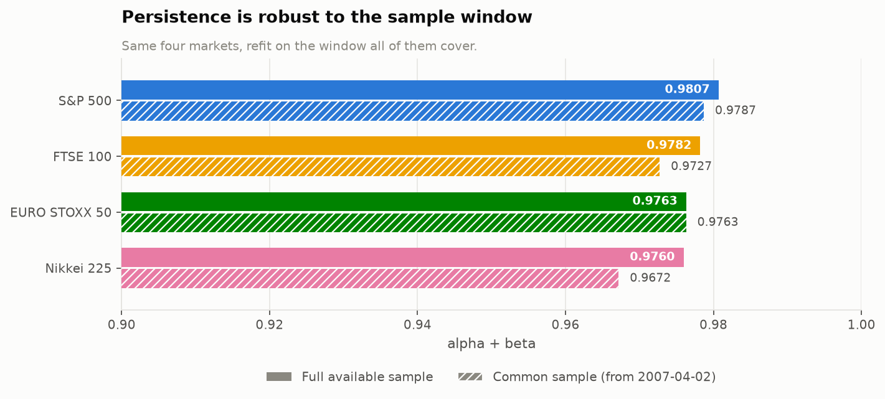

---

## 8. Residual diagnostics

If the model has captured the dynamics, the standardised residuals zₜ = εₜ/σₜ should be
approximately i.i.d.

**GARCH(1,1)-Normal, tested at 20 lags:**

| Index | No autocorrelation in z | No autocorrelation in z² | No remaining ARCH | Residuals normal |
|---|---|---|---|---|
| S&P 500 | **fail** (p=0.026) | pass (p=0.41) | pass (p=0.43) | **fail** |
| EURO STOXX 50 | pass (p=0.82) | pass (p=0.47) | pass (p=0.43) | **fail** |
| Nikkei 225 | pass (p=0.94) | pass (p=0.43) | pass (p=0.41) | **fail** |
| FTSE 100 | pass (p=0.68) | pass (p=0.31) | pass (p=0.30) | **fail** |

**Q5 — are standardised residuals still autocorrelated?** In z², **no** — GARCH(1,1)
absorbs the volatility clustering completely in all four markets, and ARCH-LM agrees.
That is the model working as intended.

Two failures remain, and they are different in kind:

**The normality rejection is expected and is the point.** Even after standardising by the
conditional volatility, z retains excess kurtosis of 1.4–2.0. Fat tails are not purely a
volatility-clustering artefact — they survive it, which is exactly why Student-t
innovations improve the fit so much.

**The S&P's z autocorrelation is a mean-equation problem, not a variance one.** Ljung-Box
on z tests the mean specification. Adding a single AR(1) term confirms the diagnosis:

| Index | LB(20) p — constant mean | LB(20) p — AR(1) | BIC constant | BIC AR(1) |
|---|---|---|---|---|
| S&P 500 | 0.026 | **0.128** | 18,089.3 | **18,069.5** |
| EURO STOXX 50 | 0.843 | 0.871 | 14,990.6 | 14,989.8 |
| Nikkei 225 | 0.939 | 0.714 | 21,770.1 | 21,769.5 |
| FTSE 100 | 0.678 | 0.473 | 17,720.4 | 17,717.4 |

The S&P's p-value rises above the 5% threshold *and* BIC improves by 20 points. The other
three neither need the term nor are harmed by it. The right specification for the S&P is
AR(1)-GJR-GARCH(1,1)-t.

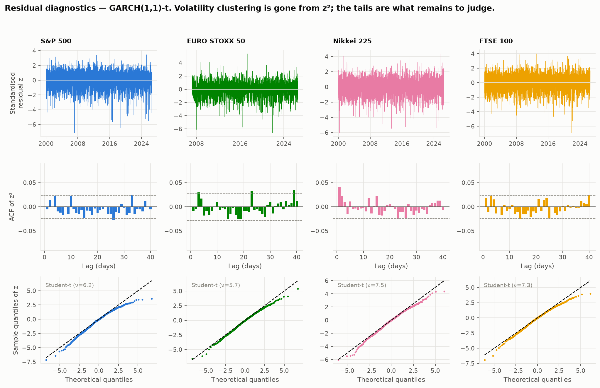

---

## 9. Out-of-sample VaR backtest

Estimation is in-sample fit; the real test is forecasting. **Design:** expanding window,
refit every 10 trading days, one-step-ahead forecasts only, out-of-sample from 2016
(~2,650 days per index). Between refits the parameters are frozen but the variance
recursion keeps running on realised returns, so no forecast uses future information. The
benchmark is a rolling 500-day historical simulation — an empirical quantile with no
volatility model at all.

**1% VaR breach rates** (target 1.0%):

| Model | S&P 500 | EURO STOXX 50 | Nikkei 225 | FTSE 100 |
|---|---|---|---|---|
| GARCH(1,1)-Normal | 2.18% | 1.85% | 2.25% | 2.14% |
| GARCH(1,1)-t | 1.69% | 1.43% | 1.47% | 1.57% |
| GJR-GARCH(1,1)-t | 1.62% | 1.28% | 1.47% | 1.42% |
| Historical simulation | 1.43% | 1.17% | 1.28% | 1.27% |

The ordering matches the in-sample model ranking — normal innovations are worst, GJR-t
best among the GARCH models — but **every model breaches the 1% limit too often**.

The more instructive result is in *which test* each approach fails:

| Approach | Kupiec (rate) | Independence (clustering) |
|---|---|---|
| Historical simulation | p ≈ 0.17–0.98 — **passes** | p ≈ 0.000 — **fails badly** |
| GARCH family | often fails at 1% | p ≈ 0.2–0.7 — **passes** |

**This contrast is the entire value proposition of conditional volatility modelling.**
Historical simulation gets the long-run average right and the timing catastrophically
wrong: because an unconditional quantile cannot widen when markets turn turbulent, its
breaches arrive in clusters. GARCH breaches are scattered. A risk limit exceeded on 40
unrelated days is survivable; one exceeded on 12 consecutive days during a crash is how
firms fail.

At the 5% level most GARCH specifications pass conditional coverage; historical
simulation fails everywhere on independence.

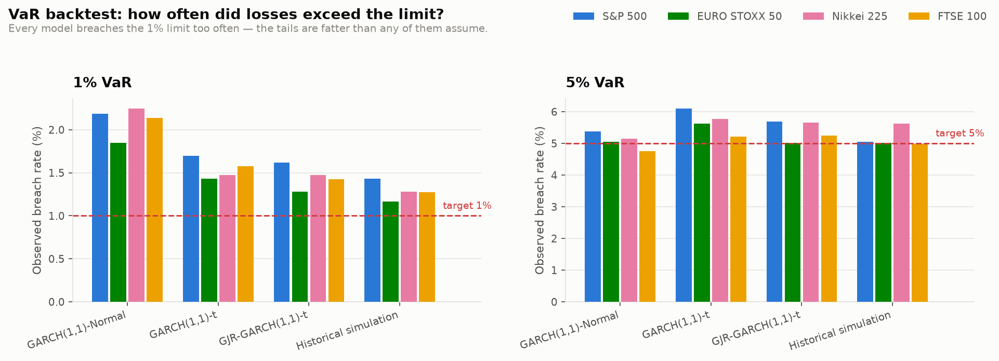

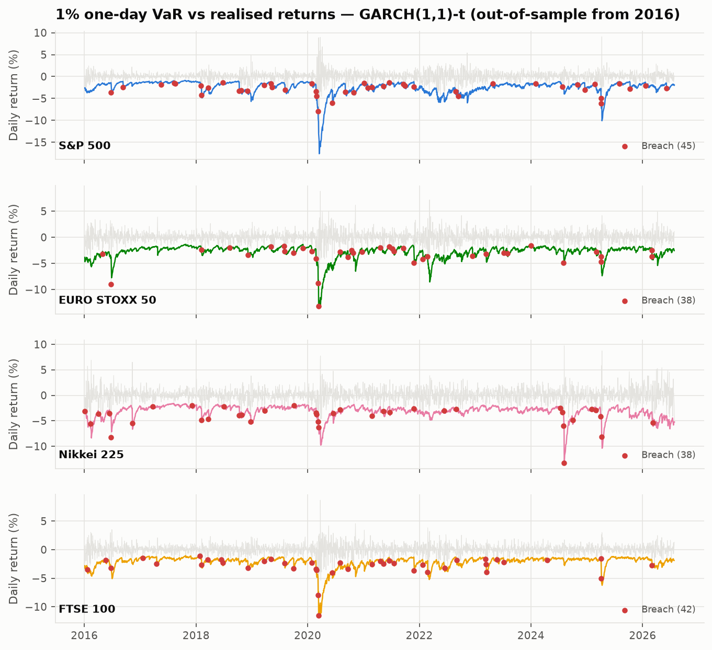

The honest conclusion: GARCH with Student-t innovations still under-states the extreme
tail. For production risk work this argues for Extreme Value Theory on the tail, or for
Expected Shortfall, which Basel III has in any case moved to.

---

## 10. Volatility forecasts

Multi-step forecasts mean-revert toward ω/(1 − α − β) at a speed set by persistence.

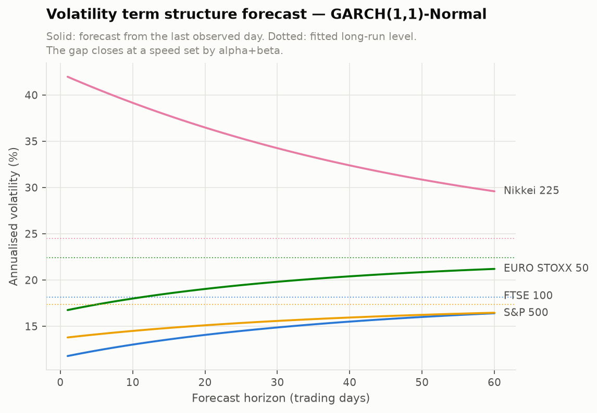

The chart makes the practical meaning of persistence concrete. The Nikkei starts the
forecast well above its long-run level and closes most of the gap within 60 days; the S&P
starts below and converges more slowly. Same model family, opposite directions, and the
rate of travel in each case is α + β.

---

## 11. Conclusions

1. **Volatility is highly persistent in every market**, α + β = 0.976–0.981, half-lives of
   28–36 trading days. Shocks last weeks, not days.
2. **The S&P 500 is the most persistent, the Nikkei the least**, and that ranking survives
   putting all four markets on a common sample.
3. **Persistence and volatility level rank almost inversely.** Two distinct risks that an
   unconditional model conflates.
4. **Student-t beats normal everywhere; GJR-GARCH beats both.** Asymmetry matters more
   than the tail assumption, and in three of four markets volatility responds to
   *nothing but* bad news.
5. **Crises are visible and regional.** All markets spike together in a global shock;
   only Europe spiked in 2011.
6. **GARCH fixes breach clustering but not tail magnitude.** Its out-of-sample value is
   conditional timing, not unconditional accuracy.

### Limitations

- **Sample mismatch.** EURO STOXX 50 has 19 years of history against 26 for the others.
  Section 7 shows the ranking survives, but it remains a real constraint.
- **Non-synchronous trading.** These markets close at different times, so a "same day"
  shock is not the same information set. Harmless for univariate models; it would need
  care in a multivariate extension.
- **Local currency, unhedged.** A dollar investor's Nikkei volatility also contains
  USD/JPY.
- **Constant parameters over 26 years** spanning the GFC, COVID and the 2022 rates shock.
  A structural-break or regime-switching model might fit better.
- **The 1% tail is under-modelled** by every specification tested.

### Extensions

Extreme Value Theory for the tail; DCC-GARCH for time-varying cross-market correlation
(the S&P–Nikkei correlation of 0.15 versus FTSE–EURO STOXX at 0.86 suggests plenty of
structure); HAR models on realised volatility from intraday data; and comparing GARCH
forecasts against option-implied volatility.

---

## Appendix — outputs

All 16 figures are in `outputs/figures/`; all 22 tables are in `outputs/tables/` as both
CSV and Markdown. `outputs/run_summary.json` holds the machine-readable headline numbers.
Full working, with commentary, is in `notebooks/garch_analysis.ipynb`.
